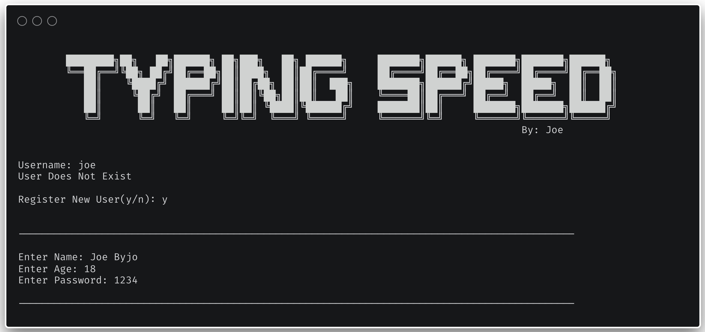
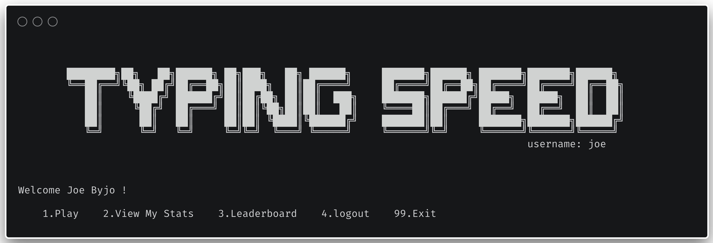
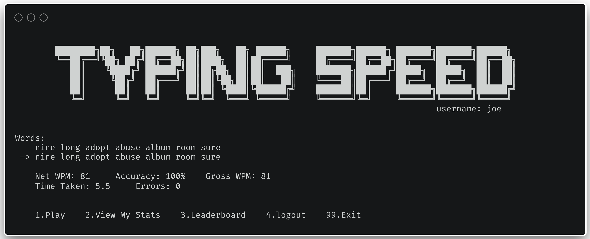
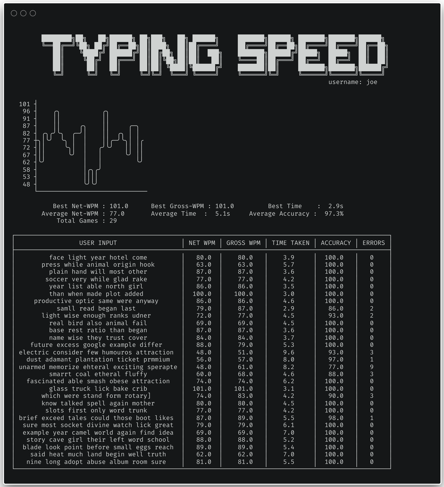
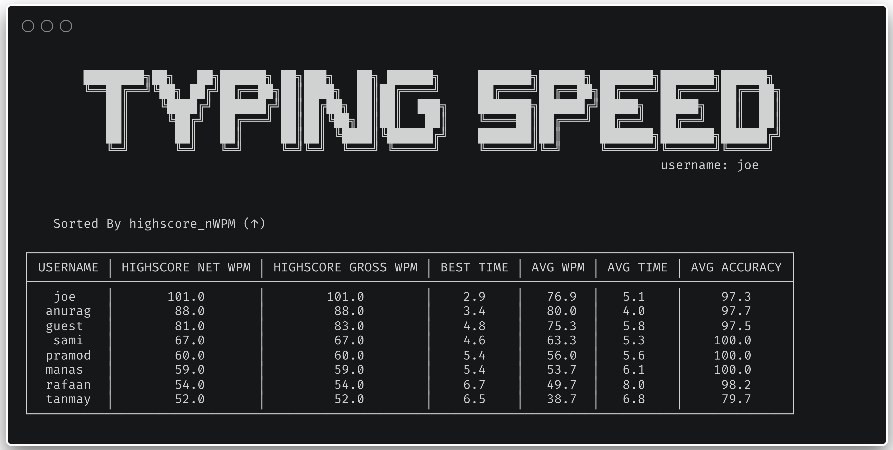

# Typing-Speed-TUI-V2

A fast and minimal **Typing Speed Test** program with a **Text User Interface (TUI)**, built using **Python** and **MySQL**.  
Version 2.0 improves usability, security, and uses MySQL to store data

---

## 📚 Table of Contents

- [🚀 Features](#-features)
- [🧰 Project Structure](#-project-structure)
- [🛠 How to Use](#-how-to-use)
- [📸 Screenshots](#-screenshots)
- [💬 Feedback and Contributions](#-feedback-and-contributions)

---

## 🚀 Features

- Console-based, fast and responsive
- No GUI overhead — perfect for low-resource systems
- Menu-driven navigation
- User login with authentication
- Secure password storage via hashing
- View previous typing test results
- Tracks statistics like Net WPM, Gross WPM, Accuracy, Errors, and Time Taken
- Leaderboard to compare scores across users
- Anti-cheat checks (zero-width character detection)
- MySQL-backed user and result storage
- Easy/Hard difficulty word modes


---

## 🧰 Project Structure

```
.
├── config.py                  # Database credentials
├── DatabaseManagement.py     # Handles all MySQL interaction
├── main.py                   # Entry point & main loop
├── TypingSpeed.py            # Core logic for typing test
├── Utils.py                  # Helper functions and utilities
├── typingspeed.sql           # MySQL schema
├── word_list_easy.txt
├── word_list_hard.txt
└── README.md
```
---


## 🛠 How to Use

1. **Clone the repository:**

```bash
git clone https://github.com/joebyjo/Typing-Speed-TUI-V2.git
cd Typing-Speed-TUI-V2
````

2. **Set up your virtual environment (optional but recommended):**

```bash
python3 -m venv venv
source venv/bin/activate  # On Windows: venv\Scripts\activate
```

3. **Install required dependencies:**

```bash
pip install -r requirements.txt
```

* Update the `config.py` file with your database credentials

4. **Run the app:**

```bash
python3 main.py
```

5. **Controls:**

* Enter your username and password (or register a new user)
* From the menu, select:

  * `1`, `p`, or `play` — Start typing test
  * `2`, `view records` — View your previous runs
  * `3`, `leaderboard` — View all-time leaderboard
  * `4`, `logout` — Switch user
  * `99`, `exit` — Exit the program

---

## 📸 Screenshots

### Login Screen



### Welcome Screen



### Typing Speed




### Stats Summary



### Leaderboard View




## ⚠️ Note

- **Font Appearance**: The appearance may differ slightly based on the **font** you use in your terminal.
- For optimal viewing, use a **monospaced font** (e.g., Consolas, Courier New).

---

## 💡 Tip

This project is completely terminal-based and perfect for practicing backend + database Python development without GUI distractions.

---

## 💬 Feedback and Contributions

I welcome feedback and contributions! Feel free to submit an issue or a pull request. Here’s how you can contribute:

1. **Fork** the repository.
2. Create a **new branch** for your feature or bugfix.
3. **Commit** your changes and **push** them to your fork.
4. **Submit a pull request** with a description of your changes.

---

